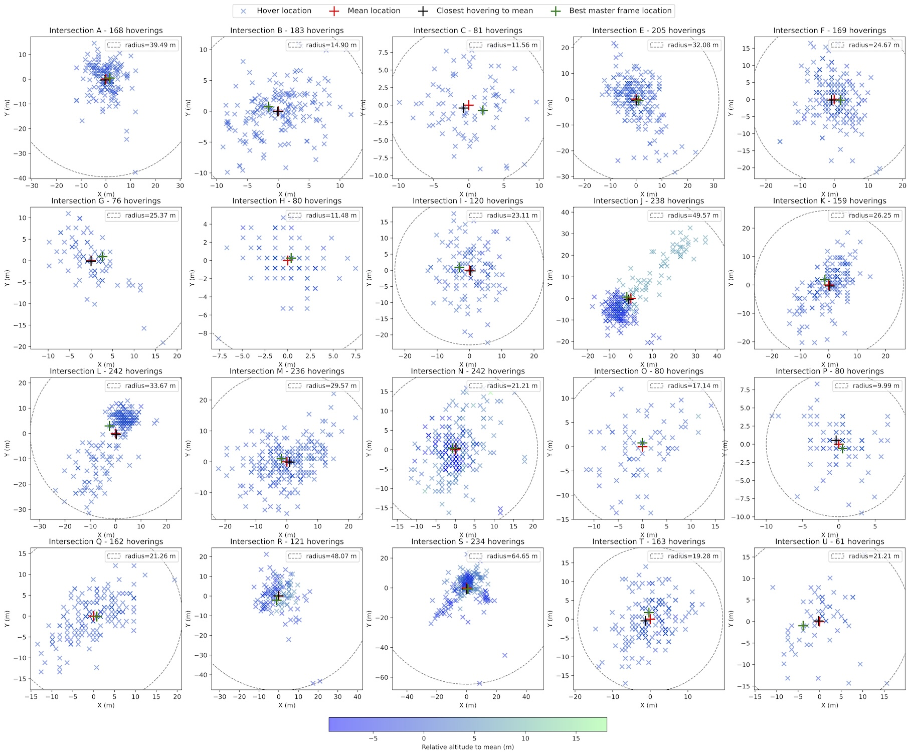
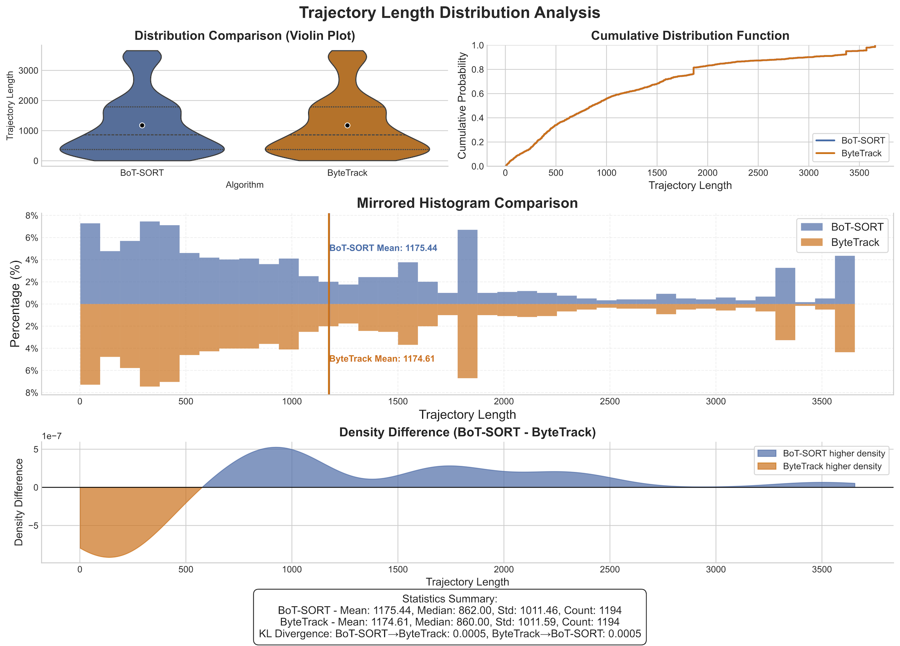
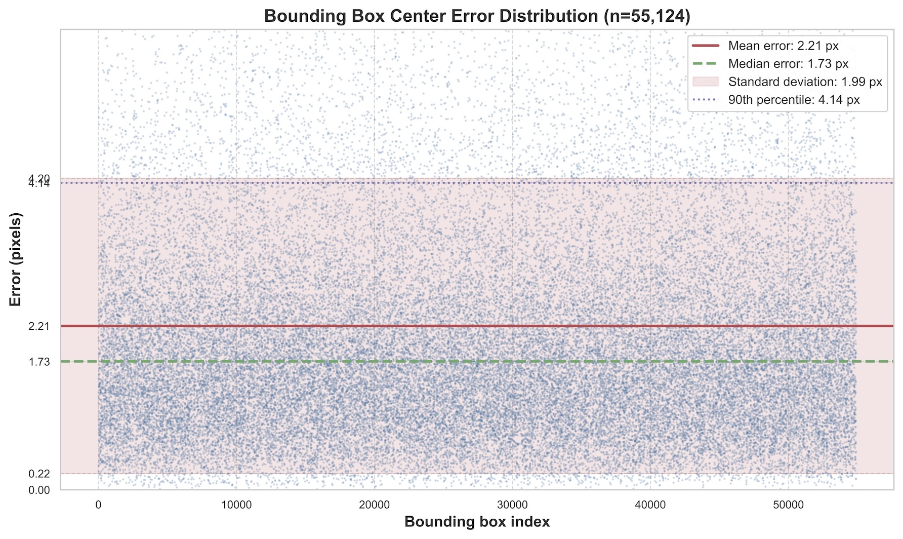
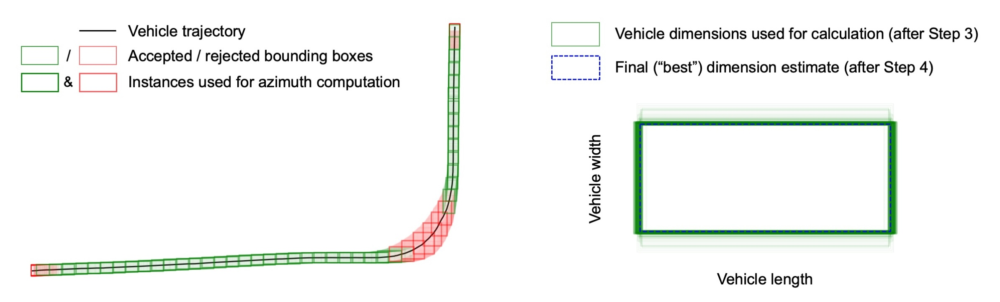

# Geo-trax Tools

Standalone analysis and data-wrangling scripts that support — but are not part of — the core
`geotrax` pipeline (see the [project README](../README.md) and `geotrax -h`). They cover dataset
preparation, annotation, georeferencing setup, and evaluation. Run any tool directly:

```bash
python tools/<name>.py -h          # full usage, arguments, and examples
```

> **Run tools from the repository root.** Logs go to the platform log directory by default;
> `--log-path`/`-lp` redirects them. Most tools accept `-c`/`--cfg` to load a pipeline config
> (see `geotrax config show`).

## Specificity legend

A few of these scripts hardcode **Songdo** experiment-specific values (or rigidly assume its
directory layout) in their *code*; the rest are reusable as-is even where the docstring cites
Songdo as the motivating example. Each tool below is tagged:

| Tag | Meaning |
|-----|---------|
| 🟢 **General** | Reusable on any compatible dataset (a Songdo mention in the docstring is just context). |
| 🔵 **Songdo** | The code hardcodes Songdo specifics — drone/AV IDs, dates, GSD, session time windows, EPSG:5186, or the Songdo `PROCESSED/` directory layout. Adapt before reuse elsewhere. |
| 🧪 **Research** | One-off analysis backing the paper; low general reuse. |

🔵/🧪 tools relate to the Songdo deployment described in
[Fonod et al. 2025](https://doi.org/10.1016/j.trc.2025.105205) (the
[Songdo Traffic](https://doi.org/10.5281/zenodo.13828383) and
[Songdo Vision](https://doi.org/10.5281/zenodo.13828407) datasets).

## Typical workflows

These chains show how the tools compose around the `geotrax` stages:

- **Footage → clips.** `merge_videos_and_logs` (per-session merge) → `cut_merged_videos_and_logs`
  (per-location clips) → `find_cut_video_issues` → `fix_timestamp_anomalies` (QA + auto-repair,
  which call `recut_video_and_log` / `interpolate_missing_timestamps`) → `geotrax extract`.
- **Georeferencing setup.** `subset_orthophoto` (orthophoto cutouts) + `find_master_frames`
  (reference frames) + `viz_segmentations` (verify lane/section overlays) → `geotrax georeference`.
- **Detection training data.** `sample_frames` → manual labelling and/or `annotate_frames`
  (pre-labels) → inspect with `viz_annotations` / `find_max_annotations` /
  `compute_bb_center_error` → convert with `fix_json_annotations` / `yolo_to_coco` → `train/`.
- **Evaluation & QA.** Trackers: `compare_tracking`. Dimensions: `analyze_bb_ratios`,
  `viz_dimension_estimation`. Georeferencing accuracy: `benchmark_ortho_matching`,
  `compare_av_detections_and_tune_filters`. Final dataset: `check_dataset`, `find_source_id`.

---

## At a glance

### 1. Footage & flight-log preparation

| Script | Purpose | Tag |
|--------|---------|-----|
| [`merge_videos_and_logs.py`](#merge_videos_and_logspy) | Merge per-flight DJI videos + SRT logs into one merged pair per session | 🟢 |
| [`cut_merged_videos_and_logs.py`](#cut_merged_videos_and_logspy) | Cut merged video/SRT into per-location clips + per-cut CSV logs | 🟢 |
| [`recut_video_and_log.py`](#recut_video_and_logpy) | Re-cut a video + its CSV log by frame range (keyframe-aligned or exact) | 🟢 |
| [`find_cut_video_issues.py`](#find_cut_video_issuespy) | Detect spatial, temporal, and camera anomalies in flight logs | 🔵 |
| [`fix_timestamp_anomalies.py`](#fix_timestamp_anomaliespy) | Auto-repair timestamp anomalies by recutting at the anomaly frame | 🔵 |
| [`interpolate_missing_timestamps.py`](#interpolate_missing_timestampspy) | Fill NaN timestamps from the frame rate (given or inferred) | 🟢 |

### 2. Training-data & annotation creation

| Script | Purpose | Tag |
|--------|---------|-----|
| [`sample_frames.py`](#sample_framespy) | Randomly sample frames from drone videos for annotation (global or balanced) | 🟢 |
| [`annotate_frames.py`](#annotate_framespy) | Run YOLO on images → YOLO-format labels (+ optional viz / masked images) | 🟢 |
| [`yolo_to_coco.py`](#yolo_to_cocopy) | Convert YOLO normalized labels → COCO JSON with absolute pixel coordinates | 🟢 |
| [`fix_json_annotations.py`](#fix_json_annotationspy) | Clean/convert COCO-like JSON (strip image data, normalize paths, HBB↔OBB) | 🟢 |
| [`find_max_annotations.py`](#find_max_annotationspy) | List top-N YOLO label files by annotation count (also a shared helper) | 🟢 |
| [`viz_annotations.py`](#viz_annotationspy) | Draw YOLO bounding boxes on images — single file or batch directory | 🟢 |

### 3. Georeferencing assets

| Script | Purpose | Tag |
|--------|---------|-----|
| [`find_master_frames.py`](#find_master_framespy) | Select optimal reference (master) frames for georeferencing from flight logs | 🟢 |
| [`subset_orthophoto.py`](#subset_orthophotopy) | Extract square PNG subsets from a large GeoTIFF orthophoto per location | 🟢 |
| [`viz_segmentations.py`](#viz_segmentationspy) | Overlay lane and road-section segmentation polygons on orthophotos | 🟢 |
| [`benchmark_ortho_matching.py`](#benchmark_ortho_matchingpy) | Benchmark orthophoto-matching reprojection error across resolutions | 🧪 |

### 4. Detection, tracking & dimension evaluation

| Script | Purpose | Tag |
|--------|---------|-----|
| [`compare_tracking.py`](#compare_trackingpy) | Compare trackers via track-length distributions and KL divergence | 🟢 |
| [`compute_bb_center_error.py`](#compute_bb_center_errorpy) | Bounding-box center error between human labels and model predictions | 🟢 |
| [`analyze_bb_ratios.py`](#analyze_bb_ratiospy) | Length/width aspect-ratio statistics and histograms per vehicle class | 🧪 |
| [`viz_dimension_estimation.py`](#viz_dimension_estimationpy) | Step-by-step visualization of the azimuth-based dimension estimator | 🔵 |
| [`compare_av_detections_and_tune_filters.py`](#compare_av_detections_and_tune_filterspy) | Compare extracted vs. RTK-GNSS AV trajectories; tune smoothing filters | 🧪 |

### 5. Dataset QA & traceability

| Script | Purpose | Tag |
|--------|---------|-----|
| [`check_dataset.py`](#check_datasetpy) | Flag vehicles with speed/acceleration violations in an aggregated dataset | 🔵 |
| [`find_source_id.py`](#find_source_idpy) | Trace an aggregated Vehicle_ID back to its source video and original ID | 🔵 |

---

## 1. Footage & flight-log preparation

Turn raw DJI drone footage and flight logs into clean, per-location clips for the pipeline.

### `merge_videos_and_logs.py`

🟢 **General** — Merges multiple per-flight DJI video files and their SRT flight logs from a
session directory into a single `0_merged.mp4` / `0_merged.srt` pair, handling the DJI counter
reset and `_trimmed` conventions. Configurable video extension and output stem; can process one
session or sweep an entire tree. (Developed for Songdo, but assumes only DJI conventions.)

```bash
python tools/merge_videos_and_logs.py /path/to/RAW --output-dir /path/to/PROCESSED
python tools/merge_videos_and_logs.py /path/to/RAW --output-dir /path/to/PROCESSED --dry-run
```

### `cut_merged_videos_and_logs.py`

🟢 **General** — Cuts merged video + SRT files into per-location clips per a cuts specification,
converting SRT records into per-clip CSV flight logs. Location names come from a user-supplied
JSON map (not hardcoded); also `--dry-run` preview and `--cleanup` to delete merged sources.

```bash
python tools/cut_merged_videos_and_logs.py /path/to/PROCESSED \
  --location-map /path/to/locations.json --cleanup
```

### `recut_video_and_log.py`

🟢 **General** — Re-cuts a video and its companion CSV log to a frame range, via a cuts file or
direct `--start`/`--end`. Defaults to keyframe-aligned cuts for codec efficiency (`--exact-cut`
for exact frames), supports `--rotate`, and rebases CSV frame numbers to start at 0.

```bash
python tools/recut_video_and_log.py video.MP4 cuts.txt
python tools/recut_video_and_log.py video.MP4 --start 120 --end 540 --rotate 90 -o cut.MP4
```

### `find_cut_video_issues.py`

🔵 **Songdo** — Scans flight logs under a `PROCESSED/` tree for spatial, temporal, and
camera-parameter anomalies (each with a tunable `*-diff-threshold`). The temporal check uses a
hardcoded Songdo session schedule (`SESSION2TIME_WINDOW`, AM1–PM5) and defaults to `epsg:5186`.
Writes stats and an anomalies CSV (consumed by `fix_timestamp_anomalies.py`) plus visualizations.

```bash
python tools/find_cut_video_issues.py /path/to/PROCESSED -s -f -viz -sv -tc
```

### `fix_timestamp_anomalies.py`

🔵 **Songdo** — Reads the anomalies CSV from `find_cut_video_issues.py` and automatically
re-cuts each affected video + log at the anomaly frame (renaming originals with `_original`).
Delegates to `recut_video_and_log.py` and can re-run `geotrax batch` on the repaired clips.

```bash
python tools/fix_timestamp_anomalies.py flight_log_anomalies.csv \
  --processed-folder /data/PROCESSED/
```

### `interpolate_missing_timestamps.py`

🟢 **General** — Fills NaN values in a CSV `timestamp` column from the video frame rate —
given via `--fps` or inferred from the spacing of the existing timestamps — forward from the
previous valid timestamp or `--backward` from the next. Works for any constant frame rate
(missing values are anchored to original timestamps to avoid rounding drift). Writes a new
`*_interpolated.CSV`, leaving the original untouched.

```bash
python tools/interpolate_missing_timestamps.py flight_log.CSV            # infer fps
python tools/interpolate_missing_timestamps.py flight_log.CSV --fps 30 --backward
```

---

## 2. Training-data & annotation creation

Build and convert the datasets used to train or evaluate the YOLO detection model.

### `sample_frames.py`

🟢 **General** — Randomly samples frames from drone videos for manual annotation: global random
sampling or `--balanced` (equal frames per video). The `--name-filter` (default `merged`) is
overridable, metadata fields are arbitrary; filter by SRT/CSV metadata (e.g.
`--srt-filter rel_alt:130:160`) and skip takeoff/landing with `--skip-start`/`--skip-end`.
Output filenames encode the source relative path for traceability.

```bash
python tools/sample_frames.py /path/to/PROCESSED /path/to/frames -n 200 --balanced
python tools/sample_frames.py /path/to/PROCESSED /path/to/frames --srt-filter rel_alt:130:160
```

### `annotate_frames.py`

🟢 **General** — Runs the configured YOLO model over a directory of images and writes YOLO-format
labels. Optionally saves box visualizations (`--save-viz`) and masked images (`--save-masked`).
Detection parameters (`--conf`, `--iou`, `--imgsz`, `--augment`, per-class conf) override config.

```bash
python tools/annotate_frames.py path/to/images/ --save-viz --conf 0.2 --augment
python tools/annotate_frames.py path/to/images/ --save-masked --margin 0.2 -z path/to/viz/
```

### `yolo_to_coco.py`

🟢 **General** — Converts a directory of YOLO `.txt` labels (normalized) to COCO JSON with
absolute pixel coordinates. The class map comes inline (`-cm 0=Car ...`), from a YAML/JSON file
(`-mf`), or — by default — is extracted from the pipeline's configured YOLO model.

```bash
python tools/yolo_to_coco.py path/to/labels/                       # class map from model (config)
python tools/yolo_to_coco.py path/to/labels/ -cm 0=Car 1=Bus 2=Truck 3=Motorcycle
```

### `fix_json_annotations.py`

🟢 **General** — Batch-cleans COCO-like JSON annotation files: strip embedded image data
(`--remove-image-data`), normalize paths (`--normalize-to-unix`/`-windows`), and convert
between horizontal and oriented boxes (`--to-obb`/`--to-hbb`).

```bash
python tools/fix_json_annotations.py path/to/annotations/ --remove-image-data
python tools/fix_json_annotations.py path/to/annotations/ --normalize-to-unix --to-obb
```

### `find_max_annotations.py`

🟢 **General** — Lists the top-N YOLO label files by annotation count (`-n`), optionally filtered
to specific classes (`--type`). Also imported as a helper by `viz_annotations.py` to pick the
busiest frames in directory mode.

```bash
python tools/find_max_annotations.py /path/to/annotations/ -n 10
python tools/find_max_annotations.py /path/to/annotations/ -n 5 --type 0 1
```

### `viz_annotations.py`

🟢 **General** — Draws YOLO bounding boxes on images for inspection. For a single image it draws
all boxes; for a directory it auto-selects the `-n` most-annotated frames (via
`find_max_annotations`). Resolve labels with `-cn` from a YAML/JSON file or inline `id:name`
pairs; filter classes with `--type`; `--show` and/or `--save`.

```bash
python tools/viz_annotations.py images/ --save -n 20 -cn names.yaml
python tools/viz_annotations.py image.jpg -cn 0:car 1:bus 2:truck --show
```

---

## 3. Georeferencing assets

Prepare the orthophotos, master frames, and segmentation overlays used by `geotrax georeference`.

### `find_master_frames.py`

🟢 **General** — Selects the best reference (master) frame per video by finding the frame closest
to the drone's mean hover position with the best detection coverage. Outputs
`best_master_frames.csv`, optional master-frame PNGs (`-smf`), and visualizations.

```bash
python tools/find_master_frames.py /path/to/PROCESSED -of /path/to/master_frames -s -smf -sv
```

Example `--visualize` output from the [Songdo experiment](../README.md#field-deployment) with 20 drones, showing the selected master frame location per intersection relative to the initial frame position of each flight clip.



### `subset_orthophoto.py`

🟢 **General** — Extracts square PNG subsets from a large GeoTIFF orthophoto, centred on
coordinates from a user-supplied JSON location dictionary, downscaled by `--scale-factor`
(crop size and scale are overridable defaults). Writes pixel-coordinate text files alongside
each crop.

```bash
python tools/subset_orthophoto.py --orthophoto-filepath ortho.tif \
  --ortho-cutout-folder output/ --location-dict-filepath locations.json
```

### `viz_segmentations.py`

🟢 **General** — Overlays lane and road-section segmentation polygons onto orthophotos. Reads any
CSV in the geo-trax segmentation format (`Section`, `Lane`, and corner-coordinate columns),
drawing red lane contours and blue section-ID labels. CSVs and output default to
`<ortho_folder>/segmentations/`.

```bash
python tools/viz_segmentations.py data/orthophotos/ -sf data/segmentations/ -o data/output/
```

### `benchmark_ortho_matching.py`

🧪 **Research** — Benchmarks orthophoto-matching accuracy by computing reprojection errors across
a range of resolutions (RootSIFT features + RANSAC/USAC_MAGSAC homography). Writes `results.txt`
with LaTeX-formatted statistics and ground-truth overlays. Built for the paper's figures.

```bash
python tools/benchmark_ortho_matching.py path/to/data -v
python tools/benchmark_ortho_matching.py path/to/data -mr 1000 -xr 10000 -rs 500 -o
```

---

## 4. Detection, tracking & dimension evaluation

Evaluate and compare pipeline components during model development and tuning.

### `compare_tracking.py`

🟢 **General** — Compares tracker performance using trajectory-length distributions and pairwise
KL divergence. Expects a `results_<tracker>/` subdirectory per tracker alongside each video.
Defaults to all six supported trackers; restrict with `--trackers`.

```bash
python tools/compare_tracking.py /path/to/videos/ --show
python tools/compare_tracking.py /path/to/videos/ --trackers botsort ocsort --save
```

Example output comparing BoT-SORT and ByteTrack on a sample flight session from the [Songdo Traffic](../README.md#field-deployment) dataset.



### `compute_bb_center_error.py`

🟢 **General** — Computes bounding-box centre error between human labels (`../labels/`) and model
predictions (`../pre-labels/`) via spatial matching. Reports per-class (or `--class-agnostic`)
statistics; `--save` writes error-distribution plots. Override paths with `-ha`/`-pa`.

```bash
python tools/compute_bb_center_error.py /path/to/images/
python tools/compute_bb_center_error.py /path/to/images/ --class-agnostic --save
```

Example output showing the bounding-box center error distribution between human annotations from the [Songdo Vision](../README.md#field-deployment) dataset and [geo-trax](https://github.com/rfonod/geo-trax) model predictions.



### `analyze_bb_ratios.py`

🧪 **Research** — Analyses length-to-width aspect ratios of vehicle bounding boxes per class,
computing descriptive statistics and optional histograms (`--hist`). Used to derive the `tau_c`
ratio thresholds for the azimuth-based dimension estimator.

```bash
python tools/analyze_bb_ratios.py data/ --hist
python tools/analyze_bb_ratios.py video.yaml --id 42
```

### `viz_dimension_estimation.py`

🔵 **Songdo** — Renders step-by-step visualizations of the azimuth-based dimension estimator for
one vehicle ID: a trajectory plot with colour-coded boxes and a dimension-distribution histogram.
Constants are tuned to the Songdo DJI Mavic 3 setup (140–150 m, 4K, EPSG:5186).

```bash
python tools/viz_dimension_estimation.py path/to/video.mp4 --id 42 --show
python tools/viz_dimension_estimation.py path/to/video.mp4 --id 42 --save
```

Example output from the [Songdo experiment](../README.md#field-deployment) showing a vehicle trajectory with accepted (green) and rejected (red) bounding boxes (left) and the resulting dimension distribution with the final estimate (right).



### `compare_av_detections_and_tune_filters.py`

🧪 **Research** — Compares extracted trajectories against RTK-GNSS ground truth from an AV test
vehicle: positional/speed errors, `--coords local|global`, and smoothing-filter tuning
(`--tune`, `--filter`). Hardcodes Songdo AV IDs, session dates, and EPSG:5186.

```bash
python tools/compare_av_detections_and_tune_filters.py data/ --show
python tools/compare_av_detections_and_tune_filters.py data/ --tune --save --filter savitzky_golay
```

The figure below illustrates the two complementary trajectory sources (drone-derived BEV and on-board probe vehicle) and how positional differences between them are computed. In the [Songdo experiment](../README.md#field-deployment), the probe vehicle was an AV equipped with high-precision RTK-GNSS sensors, provided by Stanford Center at the Incheon Global Campus (SCIGC).


---

## 5. Dataset QA & traceability

Validate and debug the aggregated output of the full pipeline.

### `check_dataset.py`

🔵 **Songdo** — Scans an aggregated CSV dataset for vehicles exceeding speed
(`--speed-threshold`, default 130 km/h) or acceleration (`--acceleration-threshold`, default
12 m/s²) limits, reporting the source video for each violation. Assumes the `DATASET/` →
`PROCESSED/` layout from the aggregation workflow.

```bash
python tools/check_dataset.py data.csv
python tools/check_dataset.py dataset/ --speed-threshold 100 --acceleration-threshold 10
```

### `find_source_id.py`

🔵 **Songdo** — Given a `Vehicle_ID` in an aggregated dataset CSV, traces it back to the original
source video and per-video ID using the `PROCESSED/` structure and the ID-offset logic from
`geotrax aggregate`. Useful for verifying or debugging specific trajectories.

```bash
python tools/find_source_id.py 2022-10-04_A/2022-10-04_A_AM1.csv 5 \
  --processed-folder /path/to/PROCESSED/
```

---

## Conventions & notes

- **Run from the repository root.** `viz_annotations.py` does
  `from find_max_annotations import find_max_annotations`, which resolves only when both files
  sit on `sys.path` together — i.e. when invoked as `python tools/viz_annotations.py …` from the
  repo root. This dependency is one reason the directory is kept flat.
- **Shared conventions.** Every tool has a structured docstring (Usage/Arguments/Options/Examples),
  `--quiet`/`-q`, and `--log-path`/`-lp`; most accept `-c`/`--cfg`.
- **File permissions.** `analyze_bb_ratios.py` and `compare_av_detections_and_tune_filters.py`
  are mode `600` (owner-only) while the rest are `644`; normalize with
  `chmod 644 tools/*.py` if desired.
